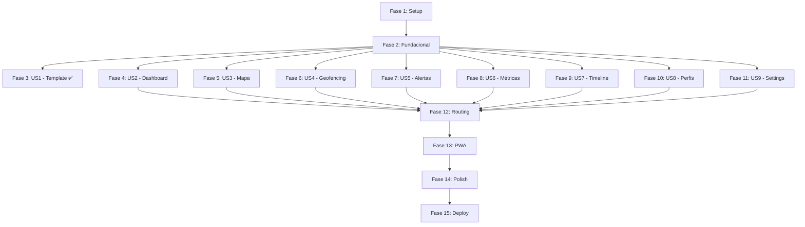

# Tarefas: Aplicação de Monitorização KIMI para Caregivers

**Branch**: `002-caregiver-monitoring-app`
**Data**: 2025-11-09
**Entrada**: Documentos de design em `/specs/002-caregiver-monitoring-app/`
**Pré-requisitos**: plan.md ✅, spec.md ✅, data-model.md ✅, contracts/ ✅, research.md ✅

**Organização**: Tarefas agrupadas por user story para implementação e teste independentes.

**Testes**: NÃO explicitamente pedidos na spec. Incluídas tarefas de validação manual/smoke tests apenas.

## Formato: `[ID] [P?] [Story] Descrição`

- **[P]**: Pode ser executada em paralelo (ficheiros diferentes, sem dependências)
- **[Story]**: User Story correspondente (US1, US2, US3...)
- Caminhos de ficheiros sempre incluídos nas descrições

---

## Fase 1: Setup (Infraestrutura Partilhada)

**Objetivo**: Replicar integralmente o Frontendtemplatekimi como base

**Tempo estimado**: 1-2 horas

- [X] T001 Criar diretório `frontend/` na raiz do projeto KIMI
- [X] T002 Copiar TODA a estrutura de `Frontendtemplatekimi/` para `frontend/` incluindo src/, public/, package.json, vite.config.ts
- [X] T003 [P] Copiar `Frontendtemplatekimi/src/styles/globals.css` PALAVRA POR PALAVRA para `frontend/src/styles/globals.css`
- [X] T004 [P] Copiar `Frontendtemplatekimi/src/components/Auth.tsx` COMPLETO para `frontend/src/components/Auth.tsx` (padrão ouro de referência)
- [X] T005 [P] Copiar TODOS os componentes `Frontendtemplatekimi/src/components/ui/*` para `frontend/src/components/ui/`
- [X] T006 [P] Copiar `Frontendtemplatekimi/src/contexts/ThemeContext.tsx` para `frontend/src/contexts/ThemeContext.tsx`
- [X] T007 [P] Copiar `Frontendtemplatekimi/src/lib/supabase.ts` para `frontend/src/lib/supabase.ts`
- [X] T008 [P] Copiar `Frontendtemplatekimi/src/imports/Group11.tsx` (logo KIMI) para `frontend/src/imports/Group11.tsx`
- [X] T009 Executar `npm install` em `frontend/` para instalar dependências do template
- [X] T010 Criar `.env.local` em `frontend/` com `VITE_SUPABASE_URL` e `VITE_SUPABASE_ANON_KEY` (obter de feature 001)
- [X] T011 Executar `npm run dev` em `frontend/` e validar que Auth.tsx renderiza com visual iOS nativo

**Checkpoint**: Template base funcional — Auth renderiza corretamente

---

## Fase 2: Fundacional (Pré-requisitos Bloqueantes)

**Objetivo**: Adicionar dependências e infraestrutura KIMI antes de qualquer user story

**⚠️ CRÍTICO**: Nenhuma user story pode começar antes desta fase

**Tempo estimado**: 1-2 horas

- [X] T012 [P] Instalar dependências adicionais: `npm install react-router-dom zustand react-window maplibre-gl` em `frontend/`
- [X] T013 [P] Instalar dependências dev: `npm install --save-dev vite-plugin-pwa vitest @testing-library/react @playwright/test` em `frontend/`
- [X] T014 Configurar `vite-plugin-pwa` em `frontend/vite.config.ts` para suporte PWA (service worker + manifest)
- [X] T015 Gerar TypeScript types via `npx supabase gen types typescript --project-id jkzwrqmbpxptncpdmbew > frontend/src/types/database.types.ts`
- [X] T016 [P] Criar `frontend/src/types/app.types.ts` com types application-level (LovedOneWithStatus, MapMarker, TimelineEvent) baseados em data-model.md
- [X] T017 Criar migration PostgreSQL `supabase/migrations/20251109000020_add_geofence_rpc_function.sql` com função `check_geofence_breach` e índices GiST (conforme data-model.md linhas 423-455)
- [X] T018 Executar migration via `supabase db push` ou Supabase Dashboard SQL Editor
- [ ] T019 Testar RPC function `check_geofence_breach` no SQL Editor com coordenadas de teste
- [X] T020 [P] Criar `frontend/src/contexts/AuthContext.tsx` wrapping Supabase Auth para gestão de sessão global
- [X] T021 [P] Criar `frontend/src/components/ErrorBoundary.tsx` seguindo padrão Auth.tsx (TC-020)

**Checkpoint**: Fundações prontas — pode iniciar user stories em paralelo

---

## Fase 3: User Story 1 - Replicação Integral do Template (P1) 🎯 MVP

**Objetivo**: Garantir que toda a base visual iOS-nativa está replicada antes de adicionar features KIMI

**Teste Independente**: Executar `npm run dev` e verificar que Auth.tsx + globals.css + ShadCN UI components renderizam com mesmo visual do template

**Tempo estimado**: Já completa na Fase 1 (1-2h)

**Nota**: Esta user story é a Fase 1 em si. Marcar como completa após T001-T011.

- [X] T022 [US1] Validar que `frontend/src/styles/globals.css` tem TODAS as CSS variables do design system iOS (--primary, --text-base, --radius, --elevation-sm, etc)
- [X] T023 [US1] Validar que `frontend/src/components/Auth.tsx` mantém TODAS as animações Motion, loading states, transições (active:scale-[0.98]) intactas
- [X] T024 [US1] Validar que `frontend/src/components/ui/*` tem TODOS os componentes ShadCN do template (Button, Input, Card, Dialog, etc)
- [X] T025 [US1] Validar que logo KIMI (Group11.tsx) está visível no Auth.tsx
- [X] T026 [US1] Smoke test: criar conta de teste (test@kimi.app) e validar que Auth funciona end-to-end

**Checkpoint**: Base visual 100% replicada — pronta para adicionar features KIMI

---

## Fase 4: User Story 2 - Dashboard de Monitorização (P2)

**Objetivo**: Dashboard central mostrando todos os loved ones com localização, métricas, bateria e alertas

**Teste Independente**: Criar dashboard que mostre cards de loved ones com dados mockados/seed data seguindo padrão Auth.tsx

**Tempo estimado**: 4-6 horas

### Implementação da User Story 2

- [X] T027 [P] [US2] Criar `frontend/src/components/Dashboard.tsx` seguindo EXATAMENTE padrão Auth.tsx (Motion, CSS variables inline, loading states, Lucide icons)
- [X] T028 [US2] Implementar query Supabase agregada em Dashboard.tsx: `loved_ones` + `last_location` + `last_metrics` + `pending_alerts` (conforme contracts/ linha 44-84)
- [X] T029 [P] [US2] Criar `frontend/src/hooks/useLovedOnes.ts` para encapsular query e transformação para `LovedOneWithStatus[]` type
- [X] T030 [US2] Renderizar grid de cards em Dashboard.tsx mostrando: full_name, device_id, avatar placeholder, última localização (timestamp), BPM, steps, bateria
- [X] T031 [US2] Adicionar indicador visual "isStale" (dados > 30 min) nos cards com cor diferente (var(--muted))
- [X] T032 [US2] Adicionar indicador de bateria crítica (<20%) com ícone Battery + cor destructive (var(--destructive))
- [X] T033 [US2] Adicionar badge de alertas pendentes no canto superior direito do card (círculo vermelho com número)
- [X] T034 [US2] Implementar estado de loading com `<Loader2 className="animate-spin" />` enquanto query carrega
- [X] T035 [US2] Implementar empty state quando caregiver não tem loved ones (texto convidativo + botão "Adicionar Primeiro")
- [X] T036 [US2] Adicionar navegação onClick do card para `/loved-one/:id/map` (preparar para US3)
- [ ] T037 [US2] Smoke test: verificar que dashboard carrega em < 3 segundos e mostra seed data corretamente

**Checkpoint**: Dashboard funcional — caregiver vê lista de loved ones

---

## Fase 5: User Story 3 - Mapa em Tempo Real (P2)

**Objetivo**: Visualizar localização atual + trail 24h + safe zones no mapa interativo

**Teste Independente**: Abrir mapa de um loved one e validar que mostra posição atual, trail histórico e safe zones

**Tempo estimado**: 6-8 horas

### Implementação da User Story 3

- [X] T038 [P] [US3] Criar `frontend/src/components/Map.tsx` seguindo padrão Auth.tsx (Motion, CSS variables, loading/error states)
- [X] T039 [P] [US3] Criar `frontend/src/lib/mapUtils.ts` com helpers MapLibre (inicializar mapa, add/remove markers, draw trail)
- [X] T040 [US3] Integrar MapLibre GL JS em Map.tsx: renderizar mapa base com OSM tiles centrado em Portugal (38.7223, -9.1393)
- [X] T041 [US3] Implementar query Supabase para trail 24h: `gps_locations` filtrado por `loved_one_id` + últimas 24h + limit 50 (conforme contracts/ linha 94-137)
- [X] T042 [P] [US3] Criar `frontend/src/hooks/useRealtimeLocation.ts` para subscribe GPS updates via Supabase Realtime (conforme contracts/ linha 376-431)
- [X] T043 [US3] Renderizar marker de localização atual no mapa (ícone personalizado + popup com timestamp, bateria)
- [X] T044 [US3] Transformar array de GPS locations em GeoJSON LineString e renderizar trail no mapa como linha conectada (conforme data-model.md linha 375-388)
- [X] T045 [US3] Query safe zones: `safe_zones` filtrado por `loved_one_id` (conforme contracts/ linha 141-179)
- [X] T046 [US3] Renderizar safe zones como círculos semitransparentes no mapa (cor: var(--primary) se ativa, var(--muted) se inativa)
- [X] T047 [US3] Implementar popup ao clicar em ponto do trail: mostrar timestamp, precisão GPS, bateria daquele momento
- [X] T048 [US3] Adicionar controles de zoom + fullscreen + rotate no mapa
- [X] T049 [US3] Subscribe realtime GPS updates: quando novo ponto chega, atualizar marker suavemente sem reload completo
- [X] T050 [US3] Implementar loading skeleton enquanto mapa carrega (usar Motion fade-in)
- [ ] T051 [US3] Smoke test: verificar que mapa renderiza em < 2 segundos com 100+ pontos e trail atualiza em realtime

**Checkpoint**: Mapa funcional — visualização geoespacial completa

---

## Fase 6: User Story 4 - Geofencing e Alertas (P2)

**Objetivo**: Definir safe zones e gerar alertas quando violadas

**Teste Independente**: Criar safe zone no mapa, simular violação (mudar coordenadas manualmente) e verificar alerta gerado

**Tempo estimado**: 4-5 horas

### Implementação da User Story 4

- [ ] T052 [P] [US4] Criar `frontend/src/hooks/useGeofence.ts` para chamar RPC `check_geofence_breach` (conforme contracts/ linha 327-369)
- [ ] T053 [US4] Adicionar botão "Criar Safe Zone" no Map.tsx que abre Dialog ShadCN
- [ ] T054 [US4] Implementar form em Dialog para criar safe zone: inputs para name (text), latitude (number), longitude (number), radius (slider 10-5000m)
- [ ] T055 [US4] Adicionar validações client-side: name não vazio, lat (-90 a 90), lng (-180 a 180), radius (10-5000) conforme data-model.md linha 624-645
- [ ] T056 [US4] Implementar POST para `safe_zones` table ao submeter form (conforme contracts/ linha 500-531)
- [ ] T057 [US4] Ao criar safe zone, adicionar círculo no mapa imediatamente (otimistic update)
- [ ] T058 [US4] Subscribe realtime mudanças de safe zones: `safe_zones` table via Realtime (conforme contracts/ linha 466-494)
- [ ] T059 [US4] Implementar toggle "Ativa/Inativa" em cada safe zone (PATCH `is_active`) conforme contracts/ linha 541-552
- [ ] T060 [US4] Integrar `useGeofence` hook no `useRealtimeLocation`: quando novo GPS chega, chamar RPC para verificar violações
- [ ] T061 [US4] Se violação detectada, criar alerta via POST para `alerts` table (conforme data-model.md linha 460-483)
- [ ] T062 [US4] Mostrar notificação toast quando alerta de geofence é gerado
- [ ] T063 [US4] Smoke test: criar safe zone "Casa", simular coordenadas fora da zona, validar que alerta aparece

**Checkpoint**: Geofencing funcional — alertas gerados em violações

---

## Fase 7: User Story 5 - Centro de Alertas (P3)

**Objetivo**: Lista de alertas ordenada por severidade com ações acknowledge/dismiss

**Teste Independente**: Abrir centro de alertas e validar que lista mostra alertas pendentes ordenados high > medium > low

**Tempo estimado**: 3-4 horas

### Implementação da User Story 5

- [ ] T064 [P] [US5] Criar `frontend/src/components/AlertCenter.tsx` seguindo padrão Auth.tsx
- [ ] T065 [P] [US5] Criar `frontend/src/stores/useAlertStore.ts` com Zustand: state (alerts[], unreadCount), actions (addAlert, acknowledge, dismiss)
- [ ] T066 [P] [US5] Criar `frontend/src/hooks/useAlerts.ts` para query alertas pendentes + subscribe realtime (conforme contracts/ linha 183-238, 436-462)
- [ ] T067 [US5] Query alertas pendentes em AlertCenter.tsx: `alerts` filtrado por `caregiver_id` + `acknowledged_at=null` + ordenado por `created_at.desc`
- [ ] T068 [US5] Ordenar alertas client-side por severity: high (vermelho) > medium (amarelo) > low (azul)
- [ ] T069 [US5] Renderizar lista de alertas com: ícone baseado em `alert_type`, título, mensagem, timestamp relativo ("há 5 min")
- [ ] T070 [US5] Adicionar badge com unreadCount no ícone de sino (header/nav)
- [ ] T071 [US5] Implementar ação "Acknowledge" (botão check) que faz PATCH `acknowledged_at` (conforme contracts/ linha 230-239)
- [ ] T072 [US5] Subscribe realtime novos alertas: quando INSERT em `alerts` table, adicionar à lista + incrementar unreadCount + mostrar toast
- [ ] T073 [US5] Implementar diferentes ícones Lucide por tipo: ShieldAlert (geofence), Battery (low_battery), Heart (abnormal_heart_rate), AlertTriangle (fall_detected)
- [ ] T074 [US5] Empty state quando não há alertas: "Tudo tranquilo! Nenhum alerta pendente" com ícone CheckCircle
- [ ] T075 [US5] Smoke test: verificar que alertas críticos (severity=high) aparecem visualmente destacados em < 5 segundos

**Checkpoint**: Centro de alertas funcional — consolidação de notificações

---

## Fase 8: User Story 6 - Métricas Biométricas (P3)

**Objetivo**: Gráficos de BPM, steps, sono usando Recharts

**Teste Independente**: Abrir secção de métricas e validar gráficos renderizam com dados das últimas 24h

**Tempo estimado**: 3-4 horas

### Implementação da User Story 6

- [ ] T076 [P] [US6] Criar `frontend/src/components/BiometricCharts.tsx` seguindo padrão Auth.tsx
- [ ] T077 [US6] Query health_metrics: `health_metrics` filtrado por `loved_one_id` + últimas 24h + ordenado por `recorded_at` (conforme contracts/ linha 245-278)
- [ ] T078 [US6] Transformar dados para formato Recharts: `HeartRateDataPoint[]` com campos `timestamp`, `bpm`, `isAbnormal` (conforme data-model.md linha 559-573)
- [ ] T079 [US6] Implementar gráfico de linha (LineChart) para BPM usando Recharts + CSS variable `var(--chart-1)` para cor
- [ ] T080 [US6] Destacar pontos anormais (BPM < 40 ou > 150) com cor `var(--destructive)` e círculo maior
- [ ] T081 [US6] Implementar gráfico de barras (BarChart) para steps diários usando `var(--chart-2)`
- [ ] T082 [US6] Implementar gráfico de barras para horas de sono usando `var(--chart-3)`
- [ ] T083 [US6] Adicionar selector de intervalo: buttons "Dia", "Semana", "Mês" que ajustam range de query
- [ ] T084 [US6] Implementar tooltip Recharts ao hover em ponto: mostrar timestamp formatado + valor exato
- [ ] T085 [US6] Adicionar loading skeleton enquanto query carrega
- [ ] T086 [US6] Smoke test: verificar que gráficos renderizam em < 1 segundo e valores anormais ficam destacados

**Checkpoint**: Métricas biométricas visualizadas — análise de saúde

---

## Fase 9: User Story 7 - Timeline Histórica (P3)

**Objetivo**: Lista cronológica de GPS + activities combinados

**Teste Independente**: Abrir timeline e validar eventos ordenados por timestamp com mini-mapas

**Tempo estimado**: 4-5 horas

### Implementação da User Story 7

- [ ] T087 [P] [US7] Criar `frontend/src/components/Timeline.tsx` seguindo padrão Auth.tsx
- [ ] T088 [US7] Query gps_locations + activities em paralelo e merge client-side ordenado por timestamp (conforme contracts/ linha 283-320)
- [ ] T089 [US7] Transformar dados para type `TimelineEvent[]` (conforme data-model.md linha 280-298)
- [ ] T090 [US7] Implementar virtualização com React Window para lidar com 100+ eventos sem degradação
- [ ] T091 [US7] Renderizar eventos de location_change com mini-mapa estático (MapLibre GL screenshot ou imagem OSM tile)
- [ ] T092 [US7] Renderizar eventos de safe_zone_entry/exit com ícone + nome da zona + timestamp
- [ ] T093 [US7] Renderizar eventos de alert_triggered com ícone + severity color + tipo de alerta
- [ ] T094 [US7] Adicionar filtro por intervalo de datas: DatePicker (ShadCN) para start_date e end_date
- [ ] T095 [US7] Implementar collapse/expand de eventos: ao clicar, mostrar detalhes completos (lat/lon, precisão, metadata)
- [ ] T096 [US7] Empty state quando intervalo selecionado não tem eventos: "Nenhuma atividade neste período"
- [ ] T097 [US7] Smoke test: verificar que timeline mostra 100+ eventos sem scroll lag

**Checkpoint**: Timeline histórica funcional — reconstrução de atividade

---

## Fase 10: User Story 8 - Gestão de Perfis (P4)

**Objetivo**: Editar perfil de loved one + adicionar/remover emergency contacts

**Teste Independente**: Abrir perfil, editar campos, validar que mudanças guardam na DB

**Tempo estimado**: 3-4 horas

### Implementação da User Story 8

- [ ] T098 [P] [US8] Criar `frontend/src/components/ProfileEditor.tsx` seguindo padrão Auth.tsx (form com React Hook Form)
- [ ] T099 [US8] Implementar form para editar `loved_ones` table: inputs para full_name, date_of_birth (DatePicker), medical_conditions (Textarea), emergency_notes (Textarea)
- [ ] T100 [US8] Implementar PATCH para `loved_ones` ao submeter form
- [ ] T101 [US8] Adicionar secção "Contactos de Emergência" no ProfileEditor
- [ ] T102 [US8] Query `emergency_contacts` filtrado por `caregiver_id` ordenado por `priority`
- [ ] T103 [US8] Renderizar lista de contactos com: contact_name, phone_number, relationship, priority
- [ ] T104 [US8] Implementar form para adicionar contacto: inputs + validação phone_number regex PT (conforme data-model.md linha 647-666)
- [ ] T105 [US8] Implementar POST para `emergency_contacts` ao adicionar contacto (conforme contracts/ linha 556-575)
- [ ] T106 [US8] Implementar ação "Remover" contacto (DELETE via Supabase)
- [ ] T107 [US8] Adicionar drag-and-drop para reordenar priority dos contactos (update priority field)
- [ ] T108 [US8] Smoke test: editar nome de loved one, adicionar contacto, validar que mudanças persistem após reload

**Checkpoint**: Gestão de perfis funcional — customização de informação

---

## Fase 11: User Story 9 - Preferências e Configurações (P4)

**Objetivo**: Settings page para configurar notificações e thresholds de alertas

**Teste Independente**: Abrir settings, ajustar toggles e thresholds, validar que preferências guardam

**Tempo estimado**: 2-3 horas

### Implementação da User Story 9

- [ ] T109 [P] [US9] Criar `frontend/src/components/Settings.tsx` seguindo padrão Auth.tsx
- [ ] T110 [US9] Query `caregiver_preferences` filtrado por `caregiver_id` (single row)
- [ ] T111 [US9] Implementar form com toggles (Switch ShadCN) para: notifications_enabled, alert_sound_enabled
- [ ] T112 [US9] Implementar inputs para quiet_hours_start e quiet_hours_end (TimePicker ou Input type="time")
- [ ] T113 [US9] Adicionar secção "Limites de Alertas" com input numérico para BPM threshold custom
- [ ] T114 [US9] Implementar PATCH para `caregiver_preferences` ao guardar settings (conforme contracts/ linha 578-592)
- [ ] T115 [US9] Adicionar botão "Restaurar Padrões" que reseta todas as preferências para valores iniciais
- [ ] T116 [US9] Adicionar toast de confirmação "Definições guardadas com sucesso!"
- [ ] T117 [US9] Smoke test: desativar notificações, guardar, reload page, validar que toggle mantém estado off

**Checkpoint**: Preferências configuradas — personalização de alertas

---

## Fase 12: Routing e Navegação

**Objetivo**: React Router v6 com AuthGuard e layouts partilhados

**Tempo estimado**: 2-3 horas

- [X] T118 Configurar `createBrowserRouter` em `frontend/src/App.tsx` com routes:
  - `/` → Dashboard
  - `/loved-one/:id/map` → Map
  - `/loved-one/:id/metrics` → BiometricCharts
  - `/loved-one/:id/timeline` → Timeline
  - `/loved-one/:id/profile` → ProfileEditor
  - `/alerts` → AlertCenter
  - `/settings` → Settings
  - `/auth` → Auth
- [X] T119 [P] Criar `frontend/src/components/Layout.tsx` com Header (logo + nav + alert badge) + Sidebar opcional + children
- [X] T120 [P] Criar `frontend/src/components/AuthGuard.tsx` que redireciona para `/auth` se `!session`
- [X] T121 Integrar AuthGuard em todas as routes exceto `/auth`
- [X] T122 Adicionar navegação mobile-friendly: BottomNav com ícones para Dashboard, Alertas, Settings
- [ ] T123 Implementar transições suaves entre rotas usando Motion `<AnimatePresence>`
- [ ] T124 Smoke test: navegar entre todas as páginas e validar que AuthGuard bloqueia quando não autenticado

**Checkpoint**: Navegação funcional — app multi-página

---

## Fase 13: PWA e Offline

**Objetivo**: Install-to-homescreen + offline read-only mode

**Tempo estimado**: 2 horas

- [ ] T125 Configurar `vite-plugin-pwa` em `frontend/vite.config.ts` com workbox strategy: NetworkFirst para API, CacheFirst para assets
- [ ] T126 [P] Criar `frontend/public/manifest.json` com name "KIMI", icons (192x192, 512x512), theme_color, background_color
- [ ] T127 [P] Gerar ícones PWA em diferentes tamanhos e adicionar em `frontend/public/icons/`
- [ ] T128 [P] Criar `frontend/src/components/OfflineBanner.tsx` que mostra aviso quando `navigator.onLine === false`
- [ ] T129 [P] Criar `frontend/src/hooks/useOfflineDetection.ts` que subscreve eventos `online`/`offline`
- [ ] T130 Integrar OfflineBanner no Layout.tsx
- [ ] T131 Configurar service worker para cachear queries Supabase mais recentes (dashboard, últimas localizações)
- [ ] T132 Smoke test: desligar WiFi, recarregar app, validar que mostra dados em cache + banner offline

**Checkpoint**: PWA funcional — modo offline básico

---

## Fase 14: Polish e Questões Transversais

**Objetivo**: Melhorias que afetam múltiplas histórias

**Tempo estimado**: 4-5 horas

- [ ] T133 [P] Validar que TODOS os componentes novos seguem padrão Auth.tsx: CSS variables inline, Motion animations, Lucide icons, loading states
- [ ] T134 [P] Executar `npm run build` e verificar que bundle JavaScript < 500KB gzipped (TC-014)
- [ ] T135 [P] Implementar code splitting: lazy load routes não-críticas (Timeline, ProfileEditor, Settings)
- [ ] T136 [P] Otimizar imagens: converter para WebP, adicionar lazy loading
- [ ] T137 Executar Lighthouse audit: validar LCP < 3s (TC-011), TTI < 5s, Accessibility > 90
- [ ] T138 [P] Adicionar meta tags SEO em `frontend/index.html`: title, description, og:image
- [ ] T139 [P] Validar que `frontend/src/styles/globals.css` não foi modificado (palavra-por-palavra do template)
- [ ] T140 Executar smoke test end-to-end completo: login → dashboard → mapa → alertas → timeline → settings → logout
- [ ] T141 [P] Atualizar `specs/002-caregiver-monitoring-app/quickstart.md` com screenshots finais e troubleshooting atualizado
- [ ] T142 [P] Criar CHANGELOG.md em `frontend/` documentando todas as features implementadas

**Checkpoint**: Aplicação polida — pronta para deploy

---

## Fase 15: Build e Deploy

**Objetivo**: Deploy para production (Vercel/Netlify)

**Tempo estimado**: 2 horas

- [ ] T143 Executar `npm run build` em `frontend/` e verificar output sem erros
- [ ] T144 Executar `npm run preview` e validar que build funciona localmente
- [ ] T145 Configurar projeto Vercel: conectar repositório GitHub, definir root directory `frontend/`, env vars `.env.production`
- [ ] T146 Deploy para staging: `vercel --prod` ou push to branch `staging`
- [ ] T147 Validar deploy staging: abrir URL, testar Auth, Dashboard, Mapa
- [ ] T148 Configurar domínio custom (se aplicável): `kimi.app` ou subdomínio
- [ ] T149 Deploy para production: merge `002-caregiver-monitoring-app` → `main` → auto-deploy
- [ ] T150 Smoke test production: validar que app está acessível em https://kimi.app e funciona end-to-end

**Checkpoint**: Aplicação deployada — LIVE em production 🚀

---

## Dependências e Ordem de Execução

### Dependências entre Fases



### Dependências entre User Stories

- **US1 (P1 - Template)**: ✅ Já completa na Fase 1 — BLOQUEANTE para todas as outras
- **US2 (P2 - Dashboard)**: Pode começar após Fase 2 — sem dependências de outras US
- **US3 (P2 - Mapa)**: Pode começar após Fase 2 — integra com US2 (navegação) mas independente
- **US4 (P2 - Geofencing)**: Depende de US3 (mapa) — pode começar em paralelo mas integra com mapa
- **US5 (P3 - Alertas)**: Depende de US4 (alertas gerados por geofencing) — mas pode usar seed data para testar independentemente
- **US6 (P3 - Métricas)**: Pode começar após Fase 2 — totalmente independente
- **US7 (P3 - Timeline)**: Pode começar após Fase 2 — totalmente independente
- **US8 (P4 - Perfis)**: Pode começar após Fase 2 — totalmente independente
- **US9 (P4 - Settings)**: Pode começar após Fase 2 — totalmente independente

### Dentro de Cada User Story

**Regra Geral**: Modelos/Hooks → Componentes → Integração → Validação

**Exemplo US2 (Dashboard)**:
1. T029 (`useLovedOnes` hook) ANTES de T027 (Dashboard.tsx)
2. T027-T036 (implementação) ANTES de T037 (smoke test)

### Oportunidades de Paralelismo

**Fase 1 (Setup)**: Todas as tarefas T003-T008 marcadas [P] podem executar em paralelo (ficheiros diferentes)

**Fase 2 (Fundacional)**: T012, T013, T016, T020, T021 marcadas [P] podem executar em paralelo

**User Stories**: Após Fase 2, podem executar em paralelo com equipa distribuída:
- Dev A: US2 (Dashboard)
- Dev B: US3 (Mapa) → US4 (Geofencing)
- Dev C: US5 (Alertas)
- Dev D: US6 (Métricas) + US7 (Timeline)

**Dentro de US**: Todas as tarefas marcadas [P] podem executar em paralelo (ex: T027, T029 em US2)

---

## Exemplo de Paralelismo: User Story 2

```bash
# Lançar hooks e componentes em paralelo:
Task T029: "Criar useLovedOnes.ts hook"
Task T027: "Criar Dashboard.tsx component"

# Depois integrar (sequencial):
Task T028: "Implementar query Supabase em Dashboard"
Task T030: "Renderizar grid de cards"
```

---

## Estratégia de Implementação

### MVP Primeiro (User Stories 1 + 2 apenas)

**Objetivo**: Entregar valor mínimo viável em 1-2 dias

1. ✅ Completar Fase 1: Setup (1-2h)
2. ✅ Completar Fase 2: Fundacional (1-2h)
3. ✅ Completar Fase 3: US1 - Template (já completa)
4. ✅ Completar Fase 4: US2 - Dashboard (4-6h)
5. **PARAR e VALIDAR**: Dashboard funcional mostrando loved ones
6. **Deploy MVP**: Apenas Auth + Dashboard = valor entregue

**Resultado**: Caregivers podem ver estado de loved ones em dashboard — funcionalidade mínima útil

### Entregas Incrementais (MVP + Features)

**Objetivo**: Adicionar features progressivamente sem quebrar MVP

1. MVP (US1+US2) → Deploy staging → Validar com utilizadores reais
2. Adicionar US3 (Mapa) → Deploy → Feedback
3. Adicionar US4 (Geofencing) → Deploy → Feedback
4. Adicionar US5 (Alertas) → Deploy → Feedback
5. Continuar até US9 conforme prioridade

**Benefício**: Cada deploy adiciona valor incremental, pode parar a qualquer momento com app funcional

### Estratégia de Equipa Paralela (3-4 developers)

**Semana 1**:
- Todos: Fase 1 + 2 (Setup + Fundacional) — 1 dia
- Dev A: US2 (Dashboard) — 2 dias
- Dev B: US3 (Mapa) — 3 dias
- Dev C: US6 (Métricas) + US7 (Timeline) — 3 dias

**Semana 2**:
- Dev A: US5 (Alertas) — 2 dias
- Dev B: US4 (Geofencing) — 2 dias
- Dev C: US8 (Perfis) + US9 (Settings) — 2 dias
- Todos: Fase 12-15 (Routing, PWA, Polish, Deploy) — 2 dias

**Resultado**: Aplicação completa em 2 semanas com 3-4 developers

---

## Notas de Implementação

### Convenções de Código

- **CSS Variables**: SEMPRE inline `style={{ fontSize: 'var(--text-base)', color: 'var(--primary)' }}`
- **Animações**: SEMPRE Motion `<motion.div initial={{ opacity: 0 }} animate={{ opacity: 1 }}>`
- **Loading**: SEMPRE `<Loader2 className="animate-spin" />`
- **Ícones**: SEMPRE Lucide React `<Mail className="w-5 h-5" />`
- **Rounded Corners**: `rounded-[var(--radius)]` ou `rounded-[var(--radius-button)]`
- **Transições**: `transition-all active:scale-[0.98]`

### Git Workflow

- Commit após cada tarefa ou grupo lógico (não esperar fase completa)
- Mensagens descritivas: `[US2] T030: Render dashboard cards with loved one data`
- Testar antes de commit: `npm run dev` + validação manual
- Push frequente para backup (não esperar PR)

### Validação Contínua

**Após cada Fase**:
1. Executar `npm run dev` e validar visualmente
2. Abrir DevTools → Console → verificar sem erros
3. Abrir DevTools → Network → verificar queries Supabase
4. Smoke test manual conforme descrito nas tarefas

**Antes de Deploy**:
1. `npm run build` sem erros
2. `npm run preview` funcional
3. Lighthouse audit > 90 performance
4. Testar em iOS Safari + Chrome

### Troubleshooting

**MapLibre não carrega**: Verificar que `maplibre-gl` CSS está importado em `main.tsx`
**Supabase 401**: Verificar que `.env.local` tem `VITE_SUPABASE_ANON_KEY` correto
**CSS variables não aplicam**: Verificar que `globals.css` está importado ANTES de outros CSS
**Animações lag**: Reduzir pontos GPS no mapa (limit 50 em vez de 100+)

---

## Sumário

**Total de Tarefas**: 150
**Tempo Estimado Total**: 45-60 horas

**Distribuição por User Story**:
- US1 (Template): 5 tarefas (1-2h) ✅ Fase 1
- US2 (Dashboard): 11 tarefas (4-6h)
- US3 (Mapa): 14 tarefas (6-8h)
- US4 (Geofencing): 12 tarefas (4-5h)
- US5 (Alertas): 12 tarefas (3-4h)
- US6 (Métricas): 11 tarefas (3-4h)
- US7 (Timeline): 11 tarefas (4-5h)
- US8 (Perfis): 11 tarefas (3-4h)
- US9 (Settings): 9 tarefas (2-3h)
- Routing: 7 tarefas (2-3h)
- PWA: 8 tarefas (2h)
- Polish: 10 tarefas (4-5h)
- Deploy: 8 tarefas (2h)
- Setup: 11 tarefas (1-2h)
- Fundacional: 10 tarefas (1-2h)

**Oportunidades de Paralelismo**: 45+ tarefas marcadas [P]

**MVP Recomendado**: Fase 1-4 (US1+US2) = 7-10 horas = 1-2 dias

**Full Feature Set**: Todas as fases = 45-60 horas = 1-2 semanas (solo) ou 1 semana (equipa de 3-4)

---

**Última Atualização**: 2025-11-09
**Status**: ✅ PRONTO PARA IMPLEMENTAÇÃO via `/speckit.implement`
